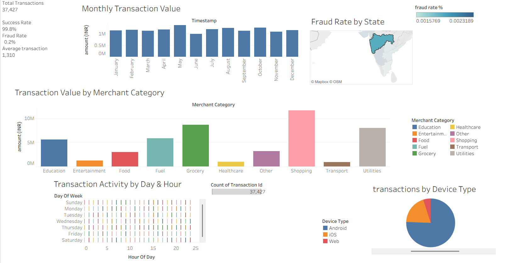

# UPI Fraud Detection Dashboard

## Overview
An interactive dashboard analyzing 37,000+ UPI (Unified Payments Interface) transaction records from 2024 to identify fraud patterns and monitor transaction success rates.

## Tools Used
- **SQL** — data cleaning, querying, and structuring raw transaction data
- **Tableau** — interactive dashboard and data visualization

## Key Insights
- Analyzed 37,000+ transactions across 2024
- Achieved visibility into a 99.8% transaction success rate
- Identified a 0.2% fraud rate, with patterns flagged for anomaly detection
- Built KPI cards, heatmaps, and geographic visualizations to track transaction trends

## What This Project Demonstrates
- Data cleaning and structuring using SQL
- Dashboard design and interactivity in Tableau
- Applying fraud/anomaly detection logic to real transaction data

- ## Dashboard Preview

